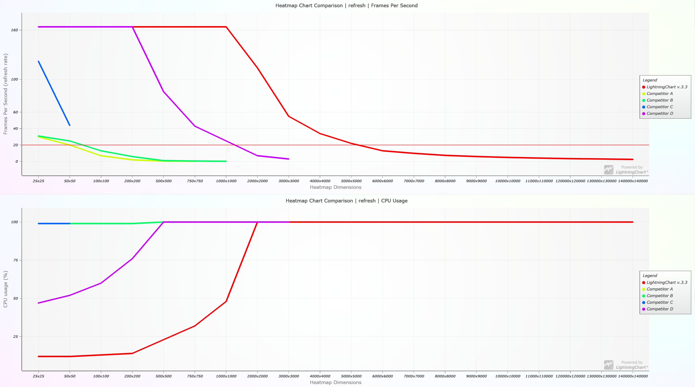

Public comparison of [LightningChart® JS](https://www.arction.com/lightningchart-js/) performance against other JavaScript charting libraries in visualizing different Heat map charts.

**UPDATE 1.12.2021**: Updated performance comparison with _LightningChart JS_ version 3.3 once again completely changes the previous results.

A separate section has been added to show the progression of _LightningChart JS_ heatmaps performance with time. Click [here](#lightningchart-js-heat-maps-performance-progression-over-time
) to jump to it.

**UPDATE 3.9.2021**: Updated performance comparison with _LightningChart JS_ version 3.1 completely overthrows the previous results.

Click [here](#results-analysis) to skip to the results analysis.

Heat maps are used for visualization of 3 dimensional data by mapping two dimensions to X and Y location and coloring the location based on the 3rd data dimension.

There are several different sub groups within heat maps in data visualization, this comparison focuses to _2D grid heat maps_.

Furthermore, 2D grid heat maps can be categorized into at least 3 types based on the application:

1. **Static heat map**. A data set is loaded and rendered as heatmap based on a color look-up table.


2. **Refreshing heat map**. In this case, the data is dynamic changing every so often (_refresh rate_). Used in weather data visualization, for example.

https://user-images.githubusercontent.com/55391673/123799657-1bcbef80-d8f1-11eb-8bcc-beba7138b1d5.mp4

3. **Appending heat map**. Also dynamic data, but in this case the previous data is not cleared, instead just shifted out as new data is pushed in. Used in audio monitoring and analysis (spectrograms), for example.

https://user-images.githubusercontent.com/55391673/123799751-31411980-d8f1-11eb-9008-08af2d882280.mp4

This repository tests JavaScript charts performance in all these different applications.

The following chart libraries are included:

- [LightningChart® JS v.3.3](https://www.arction.com/lightningchart-js/)
- [LightningChart® JS v.3.1](https://www.arction.com/lightningchart-js/)
- [LightningChart® JS v.3.0](https://www.arction.com/lightningchart-js/)
- [Highcharts v.9.1.0](https://www.highcharts.com/)
- [ECharts v.5](http://echarts.apache.org/en/index.html)
- [ZingChart v.2.9.3](https://www.zingchart.com/)
- [SciChart JS v.1.4.1633](https://www.scichart.com/javascript-chart-features/)

Competitor results are kept unidentified (for example, "Competitor A").

## Benchmarks

All referenced benchmark applications are included in this repository.

Benchmark information:

- Date: 03.09.2021
- OS: Windows 10
- CPU: Ryzen 9 5900X
- GPU: RTX 3080
- RAM: 32 GB
- Browser: Chrome & Firefox (better score is displayed)

JavaScript chart performance in heat map application is measured by gathering different performance metrics from a collection of tested heat map dimensions.

Heatmap dimensions are specified by the number of _columns_ and _rows_, for example "100x100" (10 000 data points).

### Static heat map

JavaScript chart performance in static heat map application is measured by following metrics:

- Does the chart render? If not, then the test is considered a failure.
- _Load-up speed_. This is the time (seconds) from initiating the chart to when the heat map chart becomes fully visible to the client.

The following chart is a visualization of the static heat map benchmark results.

Along X Axis the different tests (increasing data amount) are depicted.

Y Axis corresponds to the _load-up speed_ measurement, higher Y location means faster and thus better result. Line not appearing means that the test _failed_.

The range of drawn line along X Axis defines the valid range of static heat map data amount which the JavaScript chart library is capable of loading **fast**. For example, _LightningChart JS v.3.3_ is capable of loading a 35000x35000 heat map in 7.5 seconds.


### Refreshing and Appending heat maps

JavaScript chart performance in dynamic heat map applications is measured by following metrics:

- _Frames per second (FPS)_. How many times the data set is refreshed per second (average). Values are generally between 0 and 60, where below 10 shows as visibly bad performance.
- _CPU usage (%)_. Browser main thread CPU usage. Large values (> 50%) correspond to heavy power usage and less processing power for rest of the web page. When _CPU usage_ is near 100% the web page performance and interactivity starts to plummet.
- _Maximum heat map data amount_. This is derived from _FPS_, it is the maximum data amount which can be maintained with > 10 FPS.

The following charts visualize the performance of different libraries in increasingly heavy real-time heat map applications.

The last bar chart indicates the _Maximum heat map size_ where the library could function with satisfactory performance. For example, _LightningChart JS v.3.3_ performed well until 6000x6000 (refresh) and 14000x14000 (append).

**Refreshing heat map results:**

In these tests, all visible heat map data is updated as fast as possible.




**Appending heat map results:**

In these tests, live data is streamed into the heat map and displayed as fast as possible. 1 column is added between every refresh.


## Results analysis

### Static heat maps

With small heat map sizes (< 10000 total data samples) there is little variation in _load-up speed_.

However, after 500x500 threshold is passed the difference in hardware accelerated libraries speed is clear, being ready on average ~10x faster than the other JavaScript chart libraries.

Going further, all other competitors drop off as they can no longer handle the extreme amounts of data, leaving only _LightningChart JS v.3.3_ steadily scaling upwards.

In 5 seconds, _LightningChart JS v.3.3_ can display a 30000x30000 heat map with a whopping **900 million data points**.
This is **2000 times** more data than the average competitor without hardware acceleration, and **100 times** more data than the closest hardware accelerated competitor. The maximum confirmed heat map that _LightningChart JS v.3.3_ can display with 64 GB RAM is 5.6 billion data points.

The available heat map dimensions range is crucial in real-life applications, because if it is not enough it means you have to _down-sample_ your data which results in precision loss! This can be a show stopper in many cases.

Another factor that is not visible in these benchmarks is the performance of cursor, panning and zooming interactions.
While they can not be taken for granted in just any web chart, this short clip shows how heat map size does not affect the quality of _LightningChart JS_ interactions.

https://user-images.githubusercontent.com/55391673/132004145-c8778271-6a5b-454f-aa1f-3a5c492f9c8f.mp4

### Real-time heat maps

With _refreshing_ and _appending_ heat map applications **it is clear that charts without hardware acceleration can't function when heat map size exceeds even as little as 50x50;**

These libraries FPS quickly plummets to 5-15 range and even with 25x25 heat map (125 total data samples) they use 100% of available CPU power.
In practice this would mean that nothing else on the web page could do anything interactively.

In _refreshing_ stress tests, it becomes apparent that even other hardware accelerated charts can't keep up, performing on average **~6.5 times slower** and finally crashing as the heat map size exceeds 3000x3000.
_Lightning Chart JS_ persists all the way to 14000x14000 heat maps and further without crashing. With 6000x6000 heat map, _LightningChart JS_ performs with a stable refresh rate of ~13.0 times per second. The amount of data processed every second in this scenario is 468 million data points. This is the largest existing data process rate that we have ever proved in a web application.
To put it into perspective, in this case the chart is receiving data at a rate equal to 468 000 data sources with 1 kHz sample rate.

**However**, what really makes _LightningChart JS_ shine above the other charts is the _appending_ stress test;

From the results, we can see that _LightningChart JS_ is able to take performance advantage of the fact that with _appending_ heat maps the entire previous data set does not need to be updated - while the closest hardware accelerated competitor drops at around 1000x1000, _LightningChart JS_ is seemingly unaffected by the increasing data amounts and still performs with the full **160 FPS** with a 14000x14000 heat map (**196 million visible data points**!!). Furthermore, the CPU usage at this point is still only at 14% which is less than what competitors require with 25x25 heat maps.

The sheer difference in performance in this test scenario is insane; if we linearly compare data amount and FPS, _LightningChart JS_ is **19200x** more efficient than the average chart without hardware acceleration, and **1160x** more efficient than the closest hardware accelerated competitor.

To see these _next generation heat maps_ in action, head on over to our [heat maps examples gallery](https://arction.com/lightningchart-js-interactive-examples/search.html?t=heatmap).


## LightningChart JS heat maps performance progression over time

Every time we make significant improvements in LightningChart JS heatmap routines, we make sure to publish the latest results here.
This is currently the 3rd iteration of heat maps performance comparison, so we thought it would make sense to add a separate section to focus only on LightningChart and display how its performance evolves over time.

It seems that the speed of loading static heat maps as well as the achievable data capacity has shown the greatest evolution. Following is a depiction of the heat map size that can be loaded in less than 5 seconds.

- v.3.0: 2000x2000
- v.3.1: 13000x13000 (+4200 %)
- v.3.3: 30000x30000 (+530 %)


The efficiency of refreshing heatmap has also improved significantly between last two versions, v.3.1 and v.3.3 (+468 %).


And finally, the efficiency of appending heatmap. Similarly to the static heat map progression, this scenario has also evolved significantly across the versions.

- v.3.0: 43 000 data points / second
- v.3.1: 1 640 000 data points / second (+3800 %)
- v.3.3: 2 300 000 data points / second (+140 %)


Something which might not be obvious is that all _LightningChart JS_ development happens because of an identified user requirement. We hope that by writing about performance progression we highlight our ability to evolve together with our users! 

## End word

Read more about Lightning Chart JS performance why and how at our [web site](https://www.arction.com/high-performance-javascript-charts/).

## Replicating performance benchmarks

The benchmark applications and all related resources can be found in `bench/` folder.

**Hosting development server**

```
npm i --global http-server

http-server
```

Afterwards, benchmark index page can be found in `localhost:8080/bench` by typing the URL directly into a browser (like Google Chrome).

The test parameters are configured by modifying `bench/config.iife.js`. After modifications, a *cache refresh* is usually required (reload page with Shift+Ctrl+R).

_FPS_ and _Load-up speed_ metrics are measured programmatically and logged to console.

_CPU usage_ has to be manually monitored using browser developer tools.

_SciChart JS_ requires locally installed license verification software and an active license - the benchmark application can be found in `bench/scichart`.