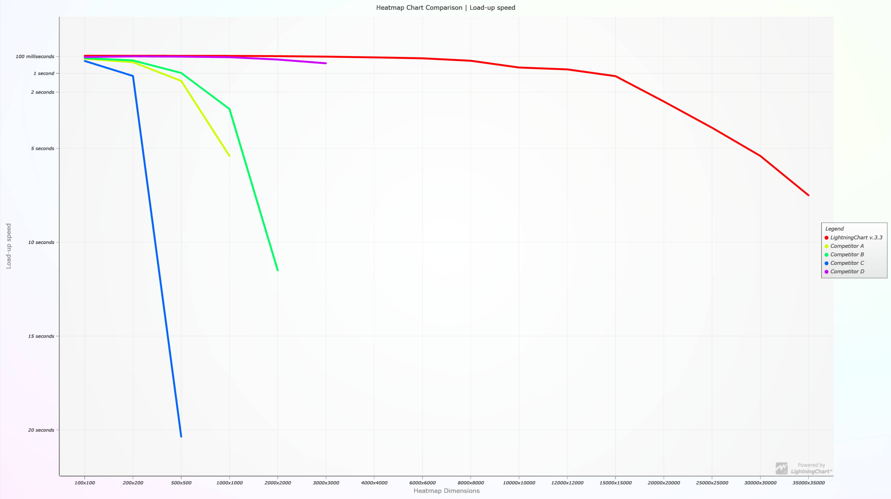

Public comparison of [LightningChart® JS](https://www.arction.com/lightningchart-js/) performance against other JavaScript charting libraries in visualizing different Heat map charts.

Heat maps are used for visualization of 3 dimensional data by mapping two dimensions to X and Y location and coloring the location based on the 3rd data dimension.

There are several different sub groups within heat maps in data visualization, this comparison focuses to _2D grid heat maps_.

Furthermore, 2D grid heat maps can be categorized into at least 3 types based on the application:

1. **Static heat map**. A data set is loaded and rendered as heatmap based on a color look-up table.


2. **Refreshing heat map**. In this case, the data is dynamic changing every so often (_refresh rate_). Used in weather data visualization, for example.

https://user-images.githubusercontent.com/55391673/123799657-1bcbef80-d8f1-11eb-8bcc-beba7138b1d5.mp4

3. **Appending heat map**. Also dynamic data, but in this case the previous data is not cleared, instead just shifted out as new data is pushed in. Used in audio monitoring and analysis (spectrograms), for example.

https://user-images.githubusercontent.com/55391673/123799751-31411980-d8f1-11eb-9008-08af2d882280.mp4

This repository tests JavaScript charts performance in all these different applications.

The following chart libraries are included:

- [LightningChart® JS v.3.0](https://www.arction.com/lightningchart-js/)
- [Highcharts v.9.1.0](https://www.highcharts.com/)
- [ECharts v.5](http://echarts.apache.org/en/index.html)
- [ZingChart v.2.9.3](https://www.zingchart.com/)

Competitor results are kept unidentified (for example, "Competitor A").

## Benchmarks

All referenced benchmark applications are included in this repository.
They were run with following machine and browser specification:

- Date: 29.06.2021
- OS: Windows 10
- Browser: Google Chrome v90.0.4430.93
- CPU: Ryzen 9 5900X
- GPU: RTX 3080
- RAM: 32 GB

JavaScript chart performance in heat map application is measured by gathering different performance metrics from a collection of tested heat map dimensions.

Heatmap dimensions are specified by the number of _columns_ and _rows_, for example "100x100" (10 000 data points).

### Static heat map

JavaScript chart performance in static heat map application is measured by following metrics:

- Does the chart render? If not, then the test is considered a failure.
- _Load-up speed_. This is the time (seconds) from initiating the chart to when the heat map chart becomes fully visible to the client.

The following chart is a visualization of the static heat map benchmark results.

Along X Axis the different tests (increasing data amount) are depicted.

Y Axis corresponds to the _load-up speed_ measurement, higher Y location means faster and thus better result. Line not appearing means that the test _failed_.

The range of drawn line along X Axis defines the valid range of static heat map data amount which the JavaScript chart library is capable of handling. For example, _LightningChart JS v3.0_ is capable of handling 5000x5000 static heat maps.



### Refreshing and Appending heat maps

JavaScript chart performance in dynamic heat map applications is measured by following metrics:

- _Frames per second (FPS)_. How many times the data set is refreshed per second (average). Values are generally between 0 and 60, where below 10 shows as visibly bad performance.
- _CPU usage (%)_. Browser main thread CPU usage. Large values (> 50%) correspond to heavy power usage and less processing power for rest of the web page. When _CPU usage_ is near 100% the web page performance and interactivity starts to plummet.
- _Maximum heat map data amount_. This is derived from _FPS_, it is the maximum data amount which can be maintained with > 10 FPS.

The test _refresh rate_ was **every frame**, and _append rate_ **1 column every frame**.

The following dashboards visualize the dynamic heat map benchmark results.

The first line chart shows _FPS_ and second line chart _CPU usage_:

Along X Axis the different tests (increasing data amount) are depicted.

Y Axis corresponds to either _FPS_ or _CPU usage_. Higher Y location is always better in terms of performance. Line not appearing means that the test _failed_.

The range of drawn line along X Axis defines the minimum valid range of dynamic heat map data amount which the JavaScript chart library is capable of handling. For example, _LightningChart JS v3.0_ is capable of handling at least 5000x5000 refreshing heat maps.

The last bar chart shows _Maximum heat map data amount_ for each chart library.


**Refreshing heat map results:**


**Appending heat map results:**


## Results analysis

With small heat map sizes (< 10000 total data samples) there is little variation in _load-up speed_.

However, after 500x500 threshold is passed the difference in hardware accelerated _LightningChart JS_ speed is clear, being ready on average ~10x faster than the other JavaScript chart libraries.

Additionally, the range of possible static heat map dimensions that can be handled by _LightningChart JS_ exceeds the other libraries by a large margin, being able to visualize a 5000x5000 heat map (total 25 million data samples) in ~25 seconds, whereas others crash quickly after exceeding total of 1 million data samples.
Thanks to hardware accelerated rendering, _LightningChart JS_ scales well with increasing heat map dimensions, so instead of crashing it just takes linearly longer time to process initially and afterwards performance is smooth!

The available heat map dimensions range is crucial in real-life applications, because if it is not enough it means you have to _down-sample_ your data which results in precision loss! This can be a show stopper in my cases.


With _refreshing_ and _appending_ heat map applications it is clear that no other library than _Lightning Chart JS_ is able to function well when heat map size exceeds even as little as 50x50;

Other libraries FPS quickly plummets to 5-15 range and even with 25x25 heat map (125 total data samples) they use 100% of available CPU power.

The bar chart of _maximum heat map data amount_ demonstrates the performance difference well, _LightningChart JS_ is able to manage heavy, fast updating dynamic heat maps all the way up to 1000x1000 (total million data point samples) with fantastic _FPS_.

Comparing _LightningChart JS_ _CPU/FPS_ performance graphs between _refreshing_ and _appending_ tests we can also see that _LightningChart JS_ is able to take performance advantage of the fact that with _appending_ heat maps the entire previous data set does not need to be updated - refreshing FPS_ with 1000x1000 heat map averages to ~10 while with _appending_ test it is ~35!

In _appending_ heat map applications, the available _data append rate_ translates to how often you can sample visualized data. For example, let's analyze the results of _Competitor A_ vs _LightningChart JS_ in a _real-time heat map visualization_ context;

For _Competitor A_, the _maximum heat map data amount_ (while keeping FPS > 10) with _data append rate_ of **1 column every frame** is 50x50. In this case the recorded actual FPS was ~19.

This means that you can only display 50 samples at once.
If we set the total time domain history length to 1 minute, this would mean that the minimum perceivable step between samples is _about 1.2 seconds_ (`60 / 50`). If a longer time is to be monitored, then the resolution will drop linearly.

In a real-life scenario, input data rarely comes in _> 1 second intervals_, which would mean that the visualization application is required to manually down-sample the data by some method, like _averaging_. However, for data analysis or any realistic purpose of data visualization this malformed data is _useless_.

Then if we take _LightningChart JS_ in the same scenario, it is able to handle 1000x1000 appending heat map with smoother _FPS_ (~35).
Immediately, you receive much more increased capabilities:
- Y samples count increased from 50 -> 1000.
- Minimum perceivable time domain step is now **60 milliseconds** (`60 / 1000`). With ~35 FPS every single step can still be visualized exactly the moment it arrives!

With asymmetric grids (10000x50, etc.) this can be even further increased, which ensures that users of _LightningChart JS_ don't have to make compromises with their data.


## End word

Read more about Lightning Chart JS performance why and how at our [web site](https://www.arction.com/high-performance-javascript-charts/).

## Replicating performance benchmarks

The benchmark applications and all related resources can be found in `bench/` folder.

**Hosting development server**

```
npm i --global http-server

http-server
```

Afterwards, benchmark index page can be found in `localhost:8080/bench` by typing the URL directly into a browser (like Google Chrome).

The test parameters are configured by modifying `bench/config.iife.js`. After modifications, a *cache refresh* is usually required (reload page with Shift+Ctrl+R).

_FPS_ and _Load-up speed_ metrics are measured programmatically and logged to console.

_CPU usage_ has to be manually monitored using browser developer tools.
